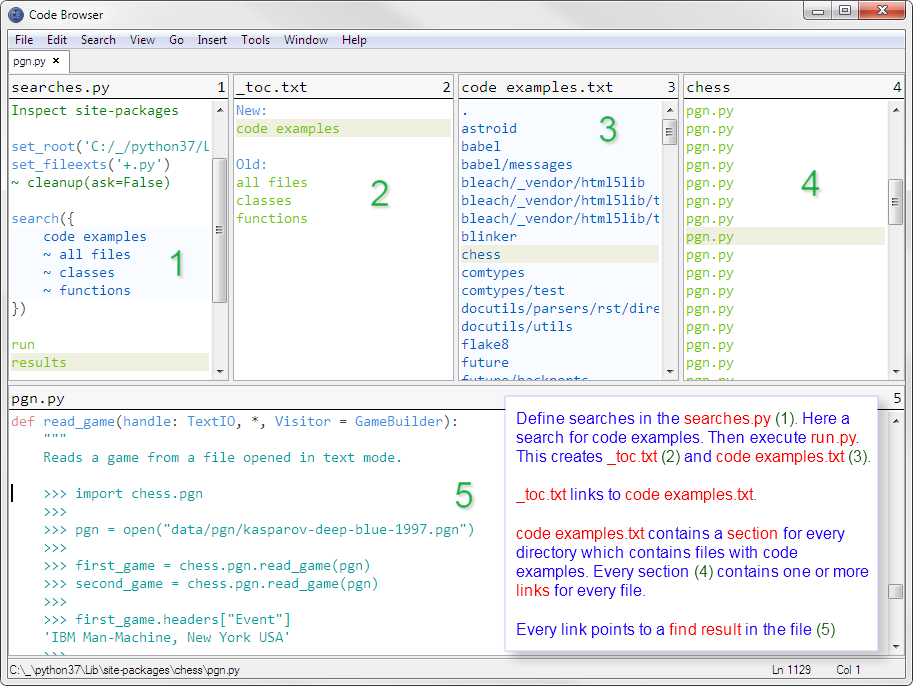

# Treesearcher

[Treesearcher](https://github.com/heronils/Treesearcher) will search for patterns in textfiles inside of directory trees. It creates result files pointing to the found locations.

The Treesearcher.info explains the details and how to use it. Try not to open that file with [Code Browser](https://github.com/heronils/Code_Browser_49) ;-)
